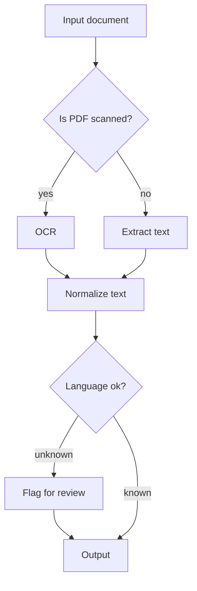
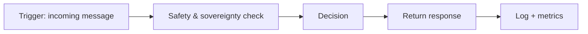

# Phase 1 — In-class design (ready to copy to paper)

## 1) System-level & sub-block diagrams

### 1.1 Global architecture (top-level)

```mermaid
flowchart LR
  U[Citizen / Civil servant\n(AR/FR request)] --> GW[Channel Gateway\n(Web/WhatsApp/Kiosk/API)]
  GW --> ORCH[Workflow Orchestrator\n(n8n-style triggers/nodes/branches)]

  ORCH --> SAFE[Safety + Sovereignty Guard\n(PII detection, policy rules)]
  SAFE -->|allow| AG[Agent Decision Core\n(tool selection)]
  SAFE -->|refuse| REF[Refusal / Redirection Message]
  SAFE -->|escalate| HUM[Human Officer Escalation]

  AG --> RET[RAG Retrieval\n(Vector DB + metadata)]
  RET --> GEN[Grounded Response\n(extractive or local LLM)]

  AG --> TR[Translate/Rewrite Tool\n(AR<->FR if needed)]
  TR --> GEN

  GEN --> GW

  subgraph Data Plane (Local-first)
    DOCS[Administrative corpus\n(PDF/TXT/Forms)] --> ING[Ingestion Pipeline\n(clean, chunk, embed)]
    ING --> VDB[(Local Vector Store\nFAISS/Chroma)]
    ING --> META[(Local Metadata Store\nJSON/SQL)]
  end

  RET --> VDB
  RET --> META

  ORCH --> LOG[(Audit Logs + Metrics)]
  AG --> LOG
  GEN --> LOG
```

Inputs/outputs (examples):
- Input: `citizen query (AR/FR)`
- Output: `procedure steps + citations` OR `refusal/escalation`

### 1.2 Sub-block diagram (RetrievalAugmented Generation)

```mermaid
flowchart TB
  Q[User query] --> N[Normalize + Lang detect]
  N --> E[Embed query]
  E --> S[Vector search Top-K]
  S --> M[Fetch metadata + source]
  M --> C[Build grounded context]
  C --> A[Answer generation\n(extractive or local LLM)]
  A --> R[Response + sources]
```

Internal logic (1–2 sentences):
- The assistant always retrieves local sources first, then answers using only retrieved context.
- If context is insufficient or user input is sensitive, it refuses or escalates.

## 2) Workflows & subworkflows (n8n style)

### 2.1 Ingestion/indexing workflow + subworkflow

Main workflow:
```mermaid
flowchart LR
  T[Trigger: schedule/manual] --> C[Collect docs from local folder] --> P[Preprocess\n(clean/OCR if needed)] --> K[Chunk] --> EM[Embeddings] --> IDX[Upsert into vector index] --> DONE[Log + report]
```

Subworkflow “Document Standardization” (with branches):


### 2.2 Query/agent workflow + decision subworkflow (3+ branches)

Main query workflow:


Decision subworkflow (minimum branches):
```mermaid
flowchart TB
  DEC[Decision step] --> B{Condition}

  B -->|needs sources| R[Retrieve document\n(Vector search + citations)]
  B -->|needs summary| S[Summarize procedure\nGrounded response]
  B -->|sensitive/PII| F[Refuse or redact\nSovereignty/ethics]
  B -->|complex complaint| H[Escalate to human officer]

  R --> OUT[Output]
  S --> OUT
  F --> OUT
  H --> OUT
```

## 3) Agent decision pseudocode + evaluation hooks

### 3.1 Pseudocode (language-agnostic)

```text
loop for each incoming_user_message:
  log_interaction(message)

  if contains_sensitive_data(message):
      tool_select = NONE
      generate_response = REFUSAL
      return refusal_message

  if is_complaint_or_legal(message):
      tool_select = HUMAN_ESCALATION
      generate_response = ESCALATION
      return escalation_message

  tool_select = RETRIEVE
  context = retrieve_top_k(message)

  if context is empty:
      generate_response = "insufficient_context"
      return "No relevant local document found"

  if user_requests_bilingual_output:
      tool_select += TRANSLATE

  generate_response = GROUNDED_ANSWER(context)
  return answer_with_sources
```

### 3.2 Evaluation hook points

Where to compute metrics:
- After `Tool_Select`: log selected branch (retrieve/summarize/refuse/escalate)
- After `Tool_Result`: log retrieved count and sources
- After `Generate_Response`: score relevance/correctness + groundedness
- After `Log_Interaction`: compute sovereignty compliance ratio

Example criteria:
- Accuracy of procedural guidance
- Sovereignty compliance ratio (local retrieval + no foreign API for sensitive data)
- Citizen satisfaction proxy (response clarity, completeness)
